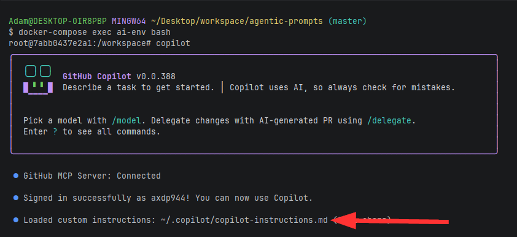

# User instructions

## Container Setup:

### docker-compose configuration:
open `docker-compose.yaml`

#### Mount .copilot to root home directory
- under `volumes` mount this project's `.copilot` directory to `/root/.copilot` 

**Example:**

**Windows**
- C:\Users\<Your User>\Desktop\workspace\agentic-prompts\.copilot:/root/.copilot
- 
**OSX/Linux**
- /home/<your user>/workspace/agentic-prompts/.copilot:~/.copilot

### Mount target project directory to docker container volume

Mount your target projects directory to a volume on your container 

**Example:**

**Windows**
- C:\Users\<Your User>\Desktop\workspace\sample-react-app:/project-dir
-
**OSX/Linux**
- /home/<your user>/workspace/sample-react-app:/project-dir

---

### docker-compose build:

Run the following commands:

* `docker-compose build`
* `docker-compose up`

Shell into container:
* `docker-compose exec ai-env bash`

## Copilot Login

* `copilot --model claude-sonnet-4.5` (Copilot should load in the CLI)
* `/login` to login to copilot by copying the URL into a web browser, paste code and login.
* On successfully login, verify that your `copilot-instruction.md` file loaded successfully from ~/.copilot:


You are now ready to interact with copilot CLI. 

## Example commands: 
The following are instructions for the user agent wrangler.

### Research:
```text
research: How to create a simple React "hello world" UI using modern best practices and tooling in 2026?
```

### Plan:
```text
plan: path/to/research-file.md 
```
### Implement:
```text
implement: path/to/plan-file.md 
```